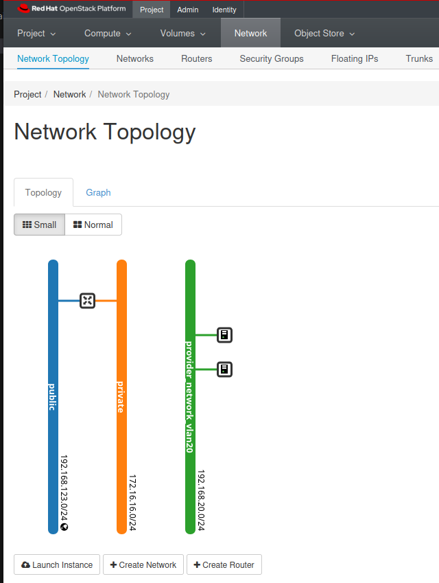

# Deploying an OSP 17 All-in-One Lab 


## Introduction

In this guide, we will demonstrate how to set up a lab environment to deploy OpenStack Platform (OSP) 17 All-in-One (AIO) on a virtual machine using KVM or on bare metal. This guide follows the documentation provided by Red Hat for deploying the all-in-one OpenStack installation, as detailed [here](https://docs.redhat.com/en/documentation/red_hat_openstack_platform/17.0/html-single/standalone_deployment_guide/index#deploying-the-all-in-one-openstack-installation). We will also cover day 2 operations to complete and manage your OpenStack environment.

## Prerequisites

- A CentOS 9 server with at least 128 GB of RAM and 500 GB of SSD storage.
- Additional disks for expanding storage as needed.

## Preparation

### Install KVM on CentOS 9

1. Update your system:
    ```bash
    sudo dnf update -y
    ```

2. Install KVM and related packages:
    ```bash
    sudo dnf install -y qemu-kvm libvirt libvirt-devel virt-install virt-top libguestfs-tools bridge-utils
    ```

3. Start and enable the libvirtd service:
    ```bash
    sudo systemctl enable --now libvirtd
    ```

4. Verify that KVM is installed correctly:
    ```bash
    sudo virt-host-validate
    ```

### Install Open vSwitch

1. Install Open vSwitch:
    ```bash
    sudo dnf install -y openvswitch
    ```

2. Start and enable the Open vSwitch service:
    ```bash
    sudo systemctl enable --now openvswitch
    ```

3. Create a bridge and configure interfaces:
    ```bash
    sudo ovs-vsctl add-br ovsbr0
    sudo ovs-vsctl add-port ovsbr0 int-ovsbr0 -- set interface int-ovsbr0 type=internal
    sudo ip addr add 192.168.123.1/24 dev int-ovsbr0
    sudo ip link set int-ovsbr0 up
    sudo ovs-vsctl add-port ovsbr0 trunk0 -- set interface trunk0 type=internal
    sudo ip link set trunk0 up
    sudo ovs-vsctl set port trunk0 trunks=20,21,22,23

    sudo ovs-vsctl add-port ovsbr0 vlan20 -- set interface vlan20 type=internal
    sudo ovs-vsctl set port vlan20 tag=20

    sudo ip addr add 192.168.20.1/24 dev vlan20
    sudo ip link set vlan20 up
    ```

### Explanation of Open vSwitch Configuration

- **Bridge Creation (`ovsbr0`)**:
  - This command creates a new Open vSwitch bridge named `ovsbr0` which will act as a virtual switch to manage network traffic.

- **Internal Interface (`int-ovsbr0`)**:
  - An internal port is added to the bridge, assigned an IP address (`192.168.123.1/24`), and brought up. This interface allows the host to communicate with the VMs connected to the bridge.

- **Trunk Port (`trunk0`)**:
  - A trunk port is added to the bridge and brought up. It is configured to allow VLANs 20, 21, 22, and 23. This is crucial for handling multiple VLANs.

- **VLAN Interface (`vlan20`)**:
  - An internal VLAN interface (`vlan20`) is created, tagged with VLAN ID 20, assigned an IP address (`192.168.20.1/24`), and brought up. This interface allows communication on VLAN 20.

### Create the libvirt Network `osp-trunk-network`

Creating a dedicated network for OSP that supports VLAN trunking is essential. This setup allows the VM to use VLANs for different provider networks within OpenStack.

1. Create a network configuration file named `osp-trunk-network.xml` with the following content:
    ```xml
    <network>
      <name>osp-trunk-network</name>
      <forward mode='bridge'/>
      <bridge name='ovsbr0'/>
      <virtualport type='openvswitch'/>
      <portgroup name='vlan-native' default='yes'>
         <tag id='1' nativeMode='untagged'/>
     </portgroup>
      <portgroup name='vlan-all'>
        <vlan trunk='yes'>
          <tag id='1' nativeMode='untagged'/>
          <tag id='20'/>
          <tag id='21'/>
          <tag id='22'/>
          <tag id='23'/>
        </vlan>
      </portgroup>
    </network>
    ```

2. Define the network using the following commands:
    ```bash
    sudo virsh net-define osp-trunk-network.xml
    sudo virsh net-start osp-trunk-network
    sudo virsh net-autostart osp-trunk-network
    ```

3. Ensure that the VM is connected in trunk mode to this network. This is crucial as it allows the VM to communicate over multiple VLANs, which is necessary for creating provider networks in OpenStack. To do this, you need to edit the VM's network interface configuration to ensure it uses the `osp-trunk-network`.

### Network Configuration Diagram

```
                           +---------------------+
                           |    CentOS9 Server   |
                           +---------------------+
                                      |
                           +---------------------+
                           |   KVM Hypervisor    |
                           +---------------------+
                                     |
                         +-----------------------+
                         |    VM: Director       |
                         +-----------------------+
                 |           |
       +---------+--+   +----+-------------------------------+
       |   eth0 (libvirt)    |   eth1                        |
       |  192.168.122.2      | (trunk)                       |
       +---------------------+--(libvirt: osp-trunk-network)-+
                                      |
                             +---------------------+
                             |     Open vSwitch    |
                             +---------------------+
                             |        ovsbr0       |
                             +---------------------+
                             |        trunk0       |
                             +---------------------+
                              |  |  |  |  |  |  |
                              |  |  |  |  |  |  |
                              +--+--+--+--+--+--+
                              |  |  |  |  |  |  |
              +---------------+  |  |  |  |  |  +---------------+
              |      |            |  |  |  |         |          |
          vlan-native   vlan20    vlan21  vlan22   vlan23     ... (other VLANs)
             (untagged)   
```

## Deployment of the Director Node Using Terraform

### Overview

The provided Terraform files (`OSP17-AIO.tf`, `network_config-osp17-aio.cfg`, `cloud-init-osp17-aio`) automate the deployment process for the OSP 17 All-in-One node. Below is an explanation of each file's purpose and the steps involved in the deployment.

1. **network_config-osp17-aio.cfg**:
   - This file defines the network configuration for the OSP node, ensuring proper network setup and connectivity within the virtual environment.

2. **OSP17-AIO.tf**:
   - This Terraform script automates the creation and configuration of the virtual machine that will host the OSP 17 All-in-One node. It specifies resources, their properties, and the necessary steps to deploy the VM.

3. **cloud-init-osp17-aio**:
   - This cloud-init script is used for the initial setup and configuration of the OSP node. It handles tasks like setting hostnames, configuring network interfaces, and preparing the system for OSP installation.
## Deployment of the Director Node on Bare Metal

### Manual Configuration Steps for Bare Metal Deployment

Below are the detailed steps for manually configuring the OSP 17 All-in-One node on a bare metal server. Note that in this configuration, `eth1` must be connected to a port trunk.

**Network Interface Assignment:**
- **eth0**: Assigned to the default network `192.168.122.0/24`. This interface is used for general connectivity and must have internet access.
- **eth1**: Assigned to the management network `192.168.25.0/24`. TripleO uses this interface for OpenStack services.

### Set Hostname and FQDN

```bash
sudo hostnamectl set-hostname aio-osp17
echo "127.0.0.1 aio-osp17 aio-osp17.lab.local" | sudo tee -a /etc/hosts
```

### Create the Stack User

```bash
# Create the stack user
sudo useradd stack

# Set password for stack user
echo "stack:stack" | sudo chpasswd

# Grant sudo privileges to stack user without password prompt
echo "stack ALL=(ALL) NOPASSWD:ALL" | sudo tee /etc/sudoers.d/stack

# Add stack user to wheel and adm groups
sudo usermod -aG wheel,adm stack

# Create .ssh directory for stack user and set permissions
sudo mkdir -p /home/stack/.ssh
echo "changeme" | sudo tee -a /home/stack/.ssh/authorized_keys
sudo chown -R stack:stack /home/stack/.ssh

# Set password for root user
echo "root:toor" | sudo chpasswd

```

### Register and Attach Subscription

```bash
sudo subscription-manager register --username <username> --password <password>
sudo subscription-manager attach --pool="changeme"
sudo subscription-manager release --set=9.2
sudo subscription-manager repos --disable="*"
```

### Enable Repositories

```bash
sudo subscription-manager repos --enable=rhel-9-for-x86_64-baseos-rpms \
  --enable=rhel-9-for-x86_64-appstream-rpms \
  --enable=rhel-9-for-x86_64-highavailability-rpms \
  --enable=openstack-17.1-for-rhel-9-x86_64-rpms \
  --enable=fast-datapath-for-rhel-9-x86_64-rpms
```

### Update System Packages

```bash
sudo dnf update -y
```
### Reboot the System

```bash
sudo reboot
```

### Install Required Packages

```bash
sudo dnf install -y python3-tripleoclient tmux wget
```


### Network Configuration Diagram for Bare Metal

```
                           +------------------+
                           |  Bare Metal Node |
                           +------------------+
                                   |
          +-----------------------+  +-------------+
          |        eth0           |  |    eth1     |
          |   (Public network)    |  | (trunk)     |
          |                       |  |             |
          +-----------------------+  +-------------+
              |(general connectivity)  |
                              +---------------------+
                              |   Physical Switch   |
                              +---------------------+
                              |        trunk        |
                              +---------------------+
                               |  |  |  |  |  |  |
                               |  |  |  |  |  |  |
                               +--+--+--+--+--+--+
                               |  |  |  |  |  |  |
             +-----------------+  |  |  |  |  |  +-----------------+
             |      |             |  |  |  |  |        |          |
         vlan-native    vlan20    vlan21  vlan22    vlan23       ... (other VLANs)
            (untagged)           (tagged)          (tagged)
```


## Configuring the All-in-One Red Hat OpenStack Platform Environment

After deploying the director machine, follow these steps to configure the all-in-one Red Hat OpenStack Platform. The configuration script (`standalone.sh`) provided automates many of these steps.

### Configuration Script Overview

Here is a detailed look at the steps performed by the `standalone.sh` script:
YOu can either run it directly to setup your AIO cluser or type mannually the commands.
1. **Set Environment Variables**:
    ```bash
    export VIP=192.168.123.3
    export IP=192.168.123.2
    export NETMASK=24
    export GATEWAY=192.168.123.1
    export INTERFACE=eth1
    export DNS_SERVER1=192.168.123.1
    export DNS_SERVER2=8.8.8.8
    ```

2. **Generate the containers-prepare-parameters.yaml file that contains the default ContainerImagePrepare parameters**:
    ```bash
    openstack tripleo container image prepare default --output-env-file $HOME/containers-prepare-parameters.yaml
    sudo tee -a $HOME/containers-prepare-parameters.yaml << EOF
      ContainerImageRegistryCredentials:
        registry.redhat.io:
          youredhatlogin: 'yourredhatpasswd'
      ContainerImageRegistryLogin: true
    EOF
    ```

3. **Create Standalone Parameters File**:
    ```bash
    cat <<EOF > $HOME/standalone_parameters.yaml
    parameter_defaults:
      CloudName: $IP
      CloudDomain: localdomain
      ControlPlaneStaticRoutes: []
      Debug: true
      DeploymentUser: $USER
      KernelIpNonLocalBind: 1
      DockerInsecureRegistryAddress:
        - $IP:8787
      NeutronPublicInterface: $INTERFACE
      NeutronDnsDomain: localdomain
      NeutronBridgeMappings: datacentre:br-ctlplane
      NeutronPhysicalBridge: br-ctlplane
      NeutronNetworkType: ["geneve","vlan","flat"]
      NeutronNetworkVLANRanges: "datacentre:1:1000"
      StandaloneEnableRoutedNetworks: false
      StandaloneHomeDir: $HOME
      StandaloneLocalMtu: 1500
      NovaComputeLibvirtType: qemu
    EOF
    ```

4. **Login to Red Hat Registry**:
    ```bash
    sudo podman login registry.redhat.io
    ```

5. **Deploy the Standalone OSP Environment**:
    ```bash
    sudo openstack tripleo deploy \
      --templates \
      --local-ip=$IP/$NETMASK \
      --control-virtual-ip=$VIP \
      -e /usr/share/openstack-tripleo-heat-templates/environments/standalone/standalone-tripleo.yaml \
      -r /usr/share/openstack-tripleo-heat-templates/roles/Standalone.yaml \
      -e $HOME/containers-prepare-parameters.yaml \
      -e $HOME/standalone_parameters.yaml \
      --output-dir $HOME \
      --standalone
    ```


This script will configure and deploy the all-in-one Red Hat OpenStack Platform environment. After the deployment is complete, you can use the `clouds.yaml` configuration file in the `/home/$USER/.config/openstack` directory to query and verify the OpenStack services.

### Verifying the Deployment

To verify the deployment, use the following commands:

1. Export the cloud environment:
    ```bash
    export OS_CLOUD=standalone
    ```

2. List OpenStack endpoints:
    ```bash
    [stack@ ~]$ openstack endpoint list
    +----------------------------------+-----------+--------------+--------------+---------+-----------+-------------------------------------------------+
    | ID                               | Region    | Service Name | Service Type | Enabled | Interface | URL                                             |
    +----------------------------------+-----------+--------------+--------------+---------+-----------+-------------------------------------------------+
    | 19e3bd71131a42bf9773177f3be92eae | regionOne | swift        | object-store | True    | admin     | http://192.168.123.3:8080                       |
    | 3a447df3f9d04f718508e479a9cf1ed7 | regionOne | cinderv3     | volumev3     | True    | public    | http://192.168.123.3:8776/v3/%(tenant_id)s      |
    | 41e0751f99a2439ba8a1b3bdbe7922fc | regionOne | nova         | compute      | True    | public    | http://192.168.123.3:8774/v2.1                  |
    | 5332f2b21f2e43bf8e6105d7a341e655 | regionOne | nova         | compute      | True    | admin     | http://192.168.123.3:8774/v2.1                  |
    | 56f08945afad4abd81edfd22bb4ace4b | regionOne | neutron      | network      | True    | public    | http://192.168.123.3:9696                       |
    | 5907d3f215db4819a2daaf1183f5102d | regionOne | cinderv3     | volumev3     | True    | internal  | http://192.168.123.3:8776/v3/%(tenant_id)s      |
    | 61efc1d924af49849e009f98b8fc024e | regionOne | glance       | image        | True    | internal  | http://192.168.123.3:9293                       |
    | 8505148ec4a644b6bbb488ebeeee107f | regionOne | nova         | compute      | True    | internal  | http://192.168.123.3:8774/v2.1                  |
    | 8a5b1414b8f14d369a40f6c50bfae201 | regionOne | keystone     | identity     | True    | public    | http://192.168.123.3:5000                       |
    | a65cf79686f54c94a2b50149b6d2f14f | regionOne | cinderv3     | volumev3     | True    | admin     | http://192.168.123.3:8776/v3/%(tenant_id)s      |
    | ae6af0f0f7084e58b35705724b4f1e19 | regionOne | neutron      | network      | True    | internal  | http://192.168.123.3:9696                       |
    | b6b6b2eb9db94b4bb7bb8296b9b4c5f1 | regionOne | neutron      | network      | True    | admin     | http://192.168.123.3:9696                       |
    | bd0d4946b7f04d41841918b1de1b9abc | regionOne | keystone     | identity     | True    | internal  | http://192.168.123.3:5000                       |
    | c5fabd4fb0464c2183a2e1ca330d24e5 | regionOne | placement    | placement    | True    | internal  | http://192.168.123.3:8778/placement             |
    | cacc212cb8454bd79057aaaba76df447 | regionOne | placement    | placement    | True    | public    | http://192.168.123.3:8778/placement             |
    | d7719c8047c74682bdbefac2b6e783d1 | regionOne | keystone     | identity     | True    | admin     | http://192.168.123.3:35357                      |
    | dc29b79a564c428ab162881c1bc1458a | regionOne | swift        | object-store | True    | internal  | http://192.168.123.3:8080/v1/AUTH_%(tenant_id)s |
    | e92a7cb0572d44d1809f9672b11784cd | regionOne | placement    | placement    | True    | admin     | http://192.168.123.3:8778/placement             |
    | f95342fe61094276886dfc5ffb800bdd | regionOne | swift        | object-store | True    | public    | http://192.168.123.3:8080/v1/AUTH_%(tenant_id)s |
    | fa25ac5a7df142c1a355681e32d29a02 | regionOne | glance       | image        | True    | public    | http://192.168.123.3:9292                       |
    | ffc5e353e99544afa3fd595717916a2c | regionOne | glance       | image        | True    | admin     | http://192.168.123.3:9293                       |
    +----------------------------------+-----------+--------------+--------------+---------+-----------+-------------------------------------------------+
    ```

3. Access the OpenStack dashboard:
    - Open a web browser and go to `http://192.168.25.2/dashboard`.
    - Use the default username `admin` and the password from the `$HOME/config/openstack/clouds.yaml` file:
        ```bash
        cat $HOME/.config/openstack/clouds.yaml | grep password:
        ```

## Extending Storage for Cinder

By default, the Cinder service uses LVM (Logical Volume Manager) for storage. The default storage capacity may be limited, so extending the volume using additional disks is often necessary. Below are the steps to add storage to an LVM volume group.

### Steps to Add Space to an LVM Volume Group

#### 1. Add a New Physical Disk

If you have a new disk available, you can add it to the server. The disk will typically be named something like `/dev/sdb` or `/dev/sdc` on physical servers, and `/dev/vdb`, `/dev/vdc`, etc., on virtual servers.

#### 2. Create an LVM Partition on the New Disk (Optional)

Use `fdisk` or `parted` to create a new partition of type LVM on the disk:

```bash
sudo fdisk /dev/sdX
# Create a new partition, type LVM (8e)
```

#### 3. Add the New Disk to the Volume Group

Use `vgextend` to add the new disk to the volume group `cinder-volumes`:

```bash
sudo vgextend cinder-volumes /dev/sdX
```

#### 4. Extend the Logical Volume Pool

Once you have added the physical space to the volume group, extend the pool `cinder-volumes-pool`:

X being the maount of Gigs you want to add

```bash
sudo lvextend -L +XG /dev/cinder-volumes/cinder-volumes-pool
```

### Commands

Below is a complete example of adding a disk and extending the pool:

```bash
# Add the new disk to the volume group
sudo vgextend cinder-volumes /dev/sdX

# Verify free space in the volume group
sudo vgs

# Extend the logical volume pool
sudo lvextend -L +20G /dev/cinder-volumes/cinder-volumes-pool

# Verify logical volumes
sudo lvs
```

### Verifying the State Before and After

Check the current state of the volume groups and logical volumes before and after extending the storage:

```bash
# Check the state of volume groups
sudo vgs

# Check the state of logical volumes
sudo lvs
```

After extending the storage, run the same commands to verify the updated state.

These steps ensure that the Cinder service has additional storage capacity, allowing for more volumes to be created and managed within OpenStack.

## Day 2 Operations: Completing OpenStack Configuration

In this part, we detail the steps to complete the configuration of your OpenStack environment, enabling features like external networking, floating IPs, and integrating with existing physical networks.

### Set Environment Variables

First, set the necessary environment variables for your configuration:

```bash
export OS_CLOUD=standalone
export GATEWAY=192.168.123.1
export STANDALONE_HOST=192.168.123.2
export PUBLIC_NETWORK_CIDR=192.168.123.0/24
export PRIVATE_NETWORK_CIDR=172.16.16.0/24
export PUBLIC_NET_START=192.168.123.230
export PUBLIC_NET_END=192.168.123.240
export DNS_SERVER=192.168.123.1
```

### Create External Network

Creating an external network is crucial for enabling floating IPs, which allow VMs to be accessed from outside the OpenStack environment.

1. **Create the Public Network**:

```bash
openstack network create --external --provider-physical-network datacentre --provider-network-type flat public
```

This command creates an external network named `public` using a flat provider network type, which is required for floating IPs.

2. **Create the Public Subnet**:

```bash
openstack subnet create public-net \
    --subnet-range $PUBLIC_NETWORK_CIDR \
    --no-dhcp \
    --gateway $GATEWAY \
    --allocation-pool start=$PUBLIC_NET_START,end=$PUBLIC_NET_END \
    --network public
```

This command creates a subnet named `public-net` on the `public` network. It specifies the CIDR range, gateway, and allocation pool for the subnet. DHCP is disabled because this subnet is for external access.

### Create Internal Network

An internal network allows your VMs to communicate with each other within the OpenStack environment.

1. **Create the Private Network**:

```bash
openstack network create --internal private
```

This command creates an internal network named `private`.

2. **Create the Private Subnet**:

```bash
openstack subnet create private-net \
    --subnet-range $PRIVATE_NETWORK_CIDR \
    --network private
```

This command creates a subnet named `private-net` on the `private` network with the specified CIDR range.

### Create Router

A router is needed to route traffic between the internal network and the external network.

1. **Create a Router**:

```bash
openstack router create vrouter
```

This command creates a router named `vrouter`.

2. **Set the Router's Gateway**:

```bash
openstack router set vrouter --external-gateway public
```
This command sets the external gateway of `vrouter` to the `public` network, enabling routing to the outside world.   
3. **Add an Interface to the Internal Network**:

```bash
openstack router add subnet vrouter private-net
```

This command adds an interface to the router vrouter for the private-net subnet, allowing routing between the internal and external networks.


### Provider Network for VLAN

Creating a provider network on VLAN 20 allows VMs to be connected directly to an existing physical network.

1. **Create a Provider Network with VLAN**:

```bash
openstack network create --provider-network-type vlan \
--provider-physical-network datacentre \
--provider-segment 20 \
--share \
provider_network_vlan20
```

This command creates a shared VLAN provider network named `provider_network_vlan20` on VLAN 20.

2. **Create a Subnet for the Provider Network**:

```bash
openstack subnet create --network provider_network_vlan20 \
--dhcp \
--allocation-pool start=192.168.20.50,end=192.168.20.100 \
--gateway 192.168.20.1 \
--subnet-range 192.168.20.0/24 \
provider-subnet_vlan20
```

This command creates a subnet named `provider-subnet_vlan20` on `provider_network_vlan20` with DHCP enabled, a specified allocation pool, and gateway.

### Download and Create Images

Download and create images in OpenStack for VM deployment.

1. **Download a Small Test Image**:

```bash
wget https://download.cirros-cloud.net/0.6.2/cirros-0.6.2-x86_64-disk.img -O cirros.img
```

2. **Create the Cirros Image**:

```bash
openstack image create cirros --file cirros.img --disk-format qcow2 --container-format bare --public
```

3. **Download a CentOS Image**:

```bash
wget https://cloud.centos.org/centos/9-stream/x86_64/images/CentOS-Stream-GenericCloud-9-latest.x86_64.qcow2 -O centos9.qcow2
```

4. **Create the CentOS Image**:

```bash
openstack image create centos9 --file centos9.qcow2 --disk-format qcow2 --container-format bare --public
```

### Create Flavors

Create various instance types (flavors) to use for VM deployment.

```bash
openstack flavor create --id 1 --ram 2048 --disk 10 --vcpus 1 small
openstack flavor create --id 2 --ram 4096 --disk 40 --vcpus 2 medium
openstack flavor create --id 3 --ram 8192 --disk 80 --vcpus 4 large
openstack flavor create --id 4 --ram 16384 --disk 160 --vcpus 8 xlarge
openstack flavor create --id 5 --ram 32768 --disk 320 --vcpus 16 xxlarge
```

These commands create several flavors with different configurations of RAM, disk, and vCPUs.

### Configure Keypair and Security Group

1. **Create a Keypair for SSH Access**:

```bash
openstack keypair create --public-key ~/.ssh/id_ed25519.pub key1
```

This command creates an OpenStack keypair named `key1` using the specified public key.

2. **Create a Security Group Allowing All Traffic**:

```bash
openstack security group create all-traffic --description "Security group allowing all traffic"
openstack security group rule create --protocol any --ingress all-traffic
```

These commands create a security group named `all-traffic` that allows all inbound traffic.

### Create and Launch Instances

1. **Create a Test Instance Using the Cirros Image**:

```bash
openstack server create --flavor small --image cirros --network provider_network_vlan20 --security-group default --key-name key1 cirros-test
```

This command creates an instance named `cirros-test` using the Cirros image and the specified flavor, network, security group, and keypair.

2. **Create a Test Instance Using the CentOS Image**:

```bash
openstack server create --flavor medium --image centos9 --network provider_network_vlan20 --security-group default --key-name key1 centos-test
```

This command creates an instance named `centos-test` using the CentOS image and the specified flavor, network, security group, and keypair.

3. **Check the result**

- Using CLI

  ```bash
  [stack@aio-osp17 ~]$ openstack server list
  +--------------------------------------+-------------+--------+---------------------------------------+---------+----------+
  | ID                                   | Name        | Status | Networks                              | Image   | Flavor   |
  +--------------------------------------+-------------+--------+---------------------------------------+---------+----------+
  | b5379b8d-927c-4172-a47e-3940103d223d | cirros-test | ACTIVE | provider_network_vlan20=192.168.20.52 | cirros  | small    |
  | 29e97d6b-921f-427c-84ad-c9817ab4b7ae | centos-test | ACTIVE | provider_network_vlan20=192.168.20.98 | centos9 | m1.small |
  +--------------------------------------+-------------+--------+---------------------------------------+---------+----------+
  ```

- Using GUI

  


These steps complete the configuration of your OpenStack environment, enabling external networking, floating IPs, and integrating with existing physical networks. By following these steps, you ensure that your OpenStack setup is fully operational and ready for deploying and managing virtual machines.

